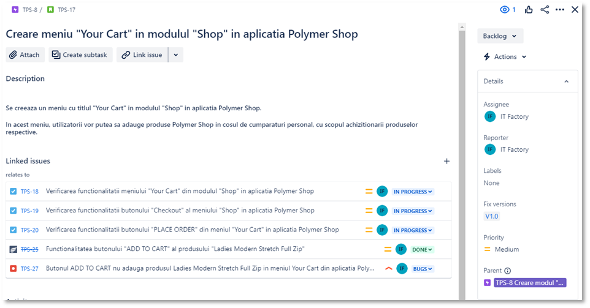

<h1>Testing Project for Polymer Shop</h1>

The primary objective of this testing plan project is to outline the strategies, scope, schedule, and approach for testing the Polymer Shop application. The goal is to ensure that all functionalities are working as expected and to identify potential bugs or performance issues.

Application under test: [Polymer Shop](https://shop.polymer-project.org/)

Tools used: Jira, Zephyr Squad.

<h2>Functional specifications:</h2>

The stories below were created in Jira and describe the functional specifications of the "SHOP" module, for which the final project is performed.

<h2>Testing process</h2>

The test process was performed based on the standard test process as described below.

<h3>1.1 Test planning</h3>

The Test Plan is designed to describe all details of testing for all the modules from the JPetStore Demo application.

The plan identifies the items to be tested, the features to be tested, the types of testing to be performed, the personnel responsible for testing, the resources and schedule required to complete testing, and the risks associated with the plan. The test plan that was created for this project can be found here [Polymer Shop Testing Plan](Polymer Shop Testing Plan.pdf)

<h4>1.1.1. Roles assigned to the project and persons allocated</h4>

<ul>
  <li>Project manager: Abigail Sing</li> 
  <li>Product owner: IBM</li>
  <li>Software developer: Daniel Pearson</li>
  <li>QA Engineer: Patricia Tulai</li>
</ul>

<h4> 1.1.2 Entry criteria defined </h4>

• Development team has completed coding and unit testing.
• All test data is prepared and available.
• All necessary test environments are set up.

<h4> 1.1.3 Exit criteria defined </h4>

• All critical and major bugs are resolved.
• 98% of test cases are passed.
• No high-severity defects remain unresolved.

<h4> 1.1.4 Test scope</h4>

<h5> Tests in scope: </h5>

**1. Product Catalog**
• Viewing products in various categories (e.g., Men’s Outwear, Ladies Outwear).
• Filtering and sorting products by price, name, or popularity.

**2. Product Details Page**
• Viewing product descriptions, prices, and available sizes/colours.
• Selecting product quantity.

**3. Cart Management**
• Adding a product to the cart.
• Modifying product quantity in the cart.
• Removing products from the cart.
• Viewing cart summary (total price, product details).

**4. Checkout**
• Entering shipping and billing information.
• Payment gateway integration (if applicable).
• Confirming orders.

**5. Navigation**
• Navigating between different pages (e.g., home, product pages, cart).
• Testing for broken links or buttons that don’t function correctly.

<h5>Tests not in scope: </h5>

• Backend database optimizations and server-side performance tuning.
• Third-party API performance (if any).
• Security Testing
• Performance Testing

<h4>1.1.5 Risks detected</h4>

**<h5>Project risks:</h5>**

**Risk 1: Incomplete execution of planned tests**
Description: Of the 10 tests written, only 3 have been run to date, indicating a potential delay in testing completion.
Impact: High - If tests remain unrun, there is a risk that other critical bugs will not be identified before release.
Probability: Medium
Priority: High
Mitigation: Allocating additional testing resources and setting clear deadlines for the execution of the remaining tests.

**Risk 2: Insufficient resources for testing**
Description: The low number of tests run suggests that the test team may be undersized or that there are issues with time and resource management.
Impact: High - Insufficient resources can lead to inadequate testing coverage, which increases the likelihood of releasing a defective product.
Probability: Medium
Priority: High
Mitigation: Reviewing resource planning, ensuring that the test team has sufficient staff and time allocated to complete all required tests.

**<h5> Product risks: </h5>**

**Risk 1: Severity A bugs**
Description: The two bugs identified with severity A may affect critical functionality of the application, having a major impact on end users.
Impact: Very High - Severity A bugs can result in data loss, users' inability to perform transactions or access critical functionality.
Likelihood: Medium - Given that bugs have already been identified, there is a chance that other critical issues are still present.
Priority: Very High
Mitigation: Immediate remediation of A-severity bugs and re-executing tests to verify application stability after remediation.

**Risk 2: Negative impact on user experience**
Description: Critical bugs directly affect the user experience, which can lead to dissatisfaction, loss of customers and damage to the app's reputation.
Impact: Very High - A broken or unstable product can negatively affect user loyalty and the commercial success of the application.
Probability: Medium
Priority: Very High
Mitigation: Focusing on quickly identifying all major functionality issues and correcting them prior to official release.

<h4>1.1.6 Evaluating entry criteria</h4>

The entry criteria defined in the Test Planning phase have been achieved and the test process can continue.

<h3>1.2 Test Monitoring and Control<h3>

**(inserati aici motivul pentru care a fost facuta etapa de monitorizare si control si respectiv cum s-a facut aceasta etapa. Aici veti insera de asemenea si raportul de status (test status report) din zephyr - test metrics - primul din lista care sa reflecte activitatea si evolutia testarii. Recomand aici sa executati teste aproape in fiecare zi ca sa vada angajatorul implicarea voastra in testare)**

<h3> 1.3 Test Analysis </h3>
The testing process will be executed based on the application requirements. <b>(The requirements analysis has been done in order to implement the <i>early testing</i> test principle and the results can be found here - inserati linkul catre documentul de review. Parte asta specificata intre paranteze o puneti doar daca aveti cerinte si daca ati facut review)</b>.   

The following test conditions were found:  

[Test Conditions](Test Conditions.png)

<h3>1.4 Test Design</h3>

Functional test cases were created in Zephyr Squad based on the analysis of the specifications. The test cases can be accessed here 

[Test Case 1](Test Case 1.png)
[Test Case 2](Test Case 2.png)
[Test Case 3](Test Case 3.png)

<h3>1.5 Test Implementation</h3>

The following elements are needed to be ready before the test execution phase begins:

**(inserati lista de elemente care sunt evaluate in etapa de implementare)**

<h3>1.6. Test Execution </h3>

Test cases are executed on the created test Cycle summary: **(inserati aici numele cycle-ului pe care l-ati creat)**

Bugs have been created based on the failed tests. The complete bug reports can be found here: 

[Bug Report 1](Bug Report 1.png)
[Bug Report 2](Bug Report 2.png)

Full regression testing is needed on the impacted areas after the bugs are fixed and retesting will be done for every functionality that was previously failed.

<h3> 1.7 Test Completion</h3>
As the Exit criteria were met and satisfied as mentioned in the appropriate section, this feature is suggested to ‘Go Live’ by the Testing team

The traceability matrix was generated and can be found here: 

[Traceability Matrix](Traceability Matrix.png)

Test execution chart was generated and can be found below. 

[Test execution chart](Raport de executie.png)

The final report shows that a number of 2 tests failed, of which there were a total of 3.

A number of 2 total bugs were found, from which the priority is high.

**<h5> Conclusion </h5>**

The "Polymer Shop" application testing project was successfully carried out, using JIRA and the Zephyr plugin to organize and track testing activities.

Within this project, 3 stories were created and planned, all covered by tests, which shows a good alignment between development requirements and testing activities.
10 tests were written to cover these stories, but only 3 of them have been executed so far.

Following the execution of the tests, 2 major bugs were identified, classified with severity A, which indicate critical issues that can significantly affect end users. Severity A suggests that these bugs affect the core functionality of the application, which can lead to a severely compromised user experience.

These issues should be addressed with the highest priority, because if left unresolved, they can lead to the inability to access certain critical features of the application.

In conclusion, although the test coverage is promising and all stories are covered, the limited test execution and critical bugs identified show that the project needs further attention to ensure the delivery of a stable and reliable application. It is essential that the development team prioritizes the resolution of identified bugs to minimize the impact on end users and improve the overall quality of the application before release.
